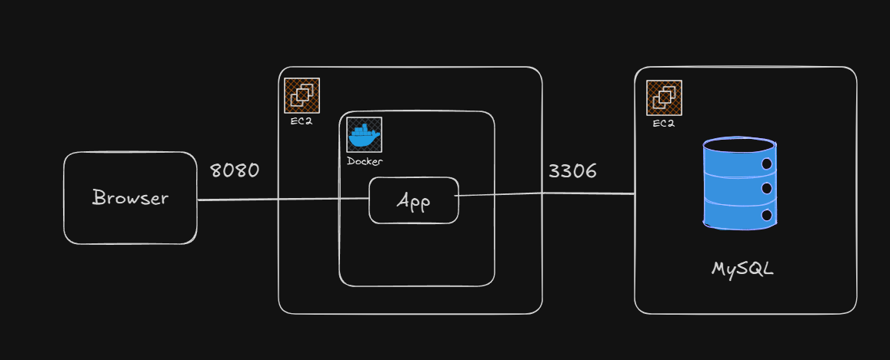

## AREP Taller 5 - CRUD de Propiedades (Spring Boot + MySQL + Docker + AWS)

Aplicación web sencilla para gestionar propiedades inmobiliarias (Create, Read, Update, Delete) con un backend en Spring Boot, persistencia con JPA/Hibernate y MySQL, frontend estático (HTML/JS) y empaquetado Docker para despliegue en AWS. Incluye pruebas unitarias del controlador y del servicio.

### Cómo ejecutar el proyecto en local

Requisitos previos:

- Java 21
- Maven 3.9+
- MySQL 8 (local o remoto)

1. Configurar base de datos MySQL (crear DB y usuario):

```
CREATE DATABASE tallerjpa CHARACTER SET utf8mb4;
CREATE USER 'myuser'@'%' IDENTIFIED BY 'Admin123!';
GRANT ALL PRIVILEGES ON tallerjpa.* TO 'myuser'@'%';
FLUSH PRIVILEGES;
```

2. Configurar propiedades de conexión:

- Archivo: `src/main/resources/application.properties`
- Variables principales:

```
spring.datasource.url=jdbc:mysql://HOST:3306/tallerjpa?useSSL=false&allowPublicKeyRetrieval=true&serverTimezone=UTC
spring.datasource.username=
spring.datasource.password=
spring.jpa.hibernate.ddl-auto=update
```

3. Construir y ejecutar:

```
mvn clean package
java -jar target/arep-taller5-1.0-SNAPSHOT.jar
```

4. Frontend estático:

- Abrir `src/main/resources/static/index.html` en el navegador o acceder a `http://localhost:8080/` si el archivo lo sirve el backend (está en `resources/static`).

5. Probar API rápidamente:

```
curl http://localhost:8080/api/properties | jq
```

## Arquitectura del sistema

- **Frontend (HTML + JavaScript)**

  - Ubicado en `src/main/resources/static/` (`index.html`, `script.js`, `styles.css`).
  - Usa `fetch` para consumir el backend REST.
  - Validación básica en cliente para campos requeridos y tipos.

- **Backend (Spring Boot REST API)**

  - Paquete raíz: `edu.eci.arep.app`.
  - Endpoints en `PropertyController` (`/api/properties`).
  - Lógica de negocio en `PropertyService`/`PropertyServiceImpl`.
  - Persistencia con `PropertyRepository` (Spring Data JPA).
  - Entidad `Property` con atributos: `id`, `address`, `price`, `size`, `description`.

- **Base de datos (MySQL)**

  - Tabla `properties` mapeada por JPA/Hibernate.
  - DDL gestionado por Hibernate (`spring.jpa.hibernate.ddl-auto=update`).

  **Diagrama**
  

## Endpoints REST principales

- GET `/api/properties` → lista todas las propiedades.
- GET `/api/properties/{id}` → trae una propiedad por id.
- POST `/api/properties` → crea una propiedad.
- PUT `/api/properties/{id}` → actualiza una propiedad completa.
- DELETE `/api/properties/{id}` → elimina una propiedad.

Reglas de validación relevantes:

- `price` debe ser mayor que 0 en creación y actualización (400 si no se cumple).
- 404 si no existe la propiedad solicitada.

## Pruebas realizadas

Se incluyeron **pruebas unitarias** (no se incluyen pruebas de integración por solicitud):

- `PropertyControllerTest` (MockMvc + Mockito)

  - Cubre GET/POST/PUT/DELETE, validaciones (400/404) y respuestas JSON.

- `PropertyServiceImplTest` (Mockito)
  - Cubre flujos de servicio, errores (eliminación inexistente), valores límite.

Ejecutar pruebas:

```
mvn test
```

## Comandos cURL útiles

- Listar todas:

```
curl -X GET http://localhost:8080/api/properties
```

- Crear:

```
curl -X POST http://localhost:8080/api/properties \
  -H "Content-Type: application/json" \
  -d '{
        "address":"Calle 123",
        "price":100000,
        "size":50,
        "description":"Casa bonita"
      }'
```

- Obtener por id:

```
curl -X GET http://localhost:8080/api/properties/1
```

- Actualizar:

```
curl -X PUT http://localhost:8080/api/properties/1 \
  -H "Content-Type: application/json" \
  -d '{
        "id":1,
        "address":"Calle 456",
        "price":150000,
        "size":75,
        "description":"Casa renovada"
      }'
```

- Eliminar:

```
curl -X DELETE http://localhost:8080/api/properties/1
```

## Despliegue en AWS (2 instancias EC2)

Objetivo: separar base de datos y aplicación en servidores distintos.

### 1) EC2 de Base de Datos (MySQL)

1. Crear instancia EC2 (Amazon Linux 2 / Ubuntu 22.04) con un Security Group que permita:
   - Puerto 22 (SSH) desde tu IP.
   - Puerto 3306 (MySQL) solo desde la IP privada/pública de la instancia APP (o tu IP para pruebas).
2. Instalar MySQL Server:

```
sudo apt update && sudo apt install -y mysql-server
sudo systemctl enable --now mysql
```

3. Configurar base y usuario (igual que en local) y opcionalmente permitir conexiones remotas (bind-address 0.0.0.0 con seguridad adecuada en el SG).
4. Anotar la **IP privada** o **pública** del servidor DB.

### 2) EC2 de Aplicación (Docker)

1. Crear instancia EC2 con SG que permita:
   - Puerto 22 (SSH) desde tu IP.
   - Puerto 8080 (HTTP app) desde Internet o desde un ALB.
2. Instalar Docker y loguearse en Docker Hub:

```
sudo apt update && sudo apt install -y docker.io
sudo usermod -aG docker $USER
newgrp docker
docker login -u jorggg
```

3. Construir y publicar la imagen :

```
docker build -t arep-taller5:latest .
docker tag arep-taller5:latest jorggg/arep-taller5:latest
docker push jorggg/arep-taller5:latest
```

4. Ejecutar el contenedor en la EC2 de aplicación apuntando al MySQL de la otra EC2:

```
docker pull jorggg/arep-taller5:latest
docker run -d --name arep-app -p 8080:8080 \
  -e SPRING_DATASOURCE_URL="jdbc:mysql://<IP_DB>:3306/tallerjpa?useSSL=false&allowPublicKeyRetrieval=true&serverTimezone=UTC" \
  -e SPRING_DATASOURCE_USERNAME="myuser" \
  -e SPRING_DATASOURCE_PASSWORD="Admin123!" \
  jorggg/arep-taller5:latest
```

## Estructura del repositorio

- `src/main/java/edu/eci/arep/app/...` código del backend (controllers, services, repository, model, dto).
- `src/main/resources/static` frontend (HTML/JS/CSS).
- `src/test/java/...` pruebas unitarias (controller y service).
- `Dockerfile` imagen de la aplicación.
- `pom.xml` dependencias y build (Spring Boot 3.3.x, JPA, MySQL, Lombok, tests).

## Video de la aplicacion desplegada

[Ver el video](taller5.mp4)

## Autor y Docker Hub

- Autor: Jorge Andrés Gamboa Sierra
- Docker Hub: `https://hub.docker.com/u/jorggg`
